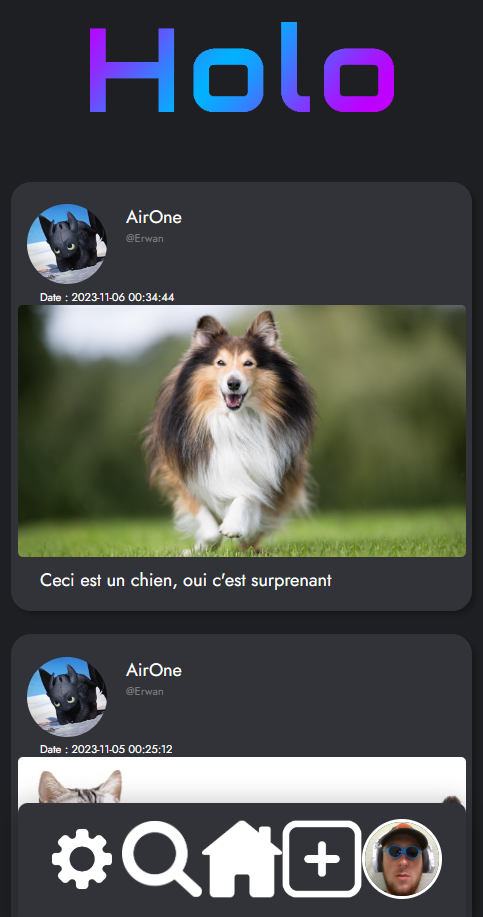
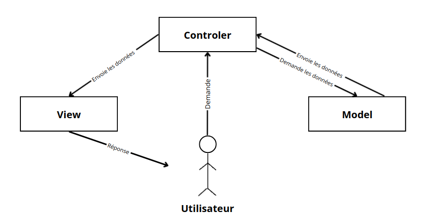
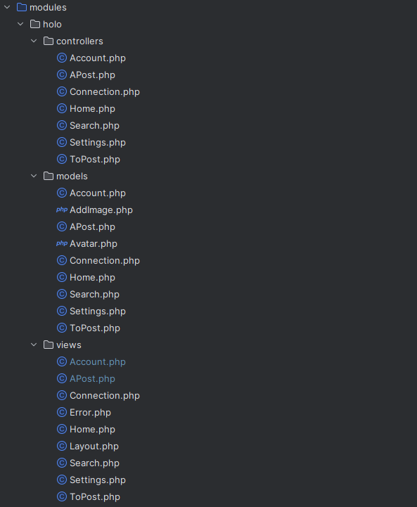
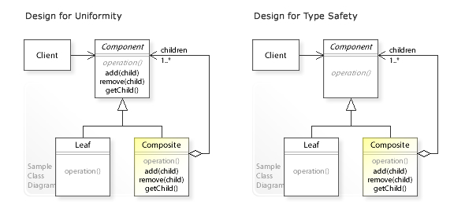

# Modèles de conception

## Sommaire
* [Introduction - Patron de conception](#introduction)
* [MVC (Modèle Vue Contrôleur)](#mvc)
  * [Qu'est ce que c'est MVC](#qu-est-ce-que-cest-mvc)
  * [Pour résoudre quels problemes](#pour-resoudre-quels-problemes)
  * [Les limites de ce modèle de conception](#les-limites-de-ce-modele-de-conception)
  * [Comment l'implémenter le MVC](#comment-limplementer-le-mvc)
* [Objet Composite](#objet-composite)
  * [Introduction](#introduction-objet-composite)
  * [Exemples](#exemples-objet-composite)
  * [Solution apportée](#solutions-apportees-objet-composite)
  * [Limites](#limites-objet-composite)
  * [Implémentation](#implementation-objet-composite)
***

## Introduction - Patron de conception

Un patron de conception en programmation orientée objet représente différents procédés de conception qui permettent la généricité de méthode pour plusieurs objets.

Le patron de conception est un moyen permettant l'intéraction entre l’architecte informatique et le programmeur sur la base d’un vocabulaire commun.

Les design patterns décrivent une solution standard en définissant les relations clés entre les interfaces de classe et les hiérarchies d’héritage.

## MVC (Modèle/Vue/Contrôleur)
### Qu'est ce que c'est MVC

Dans cette optique, l'expérience a montré qu'il était tout à fait possible de séparer le code source en trois parties distinctes relatives à chaque aspect des traitements : 
- Le modèle qui regroupe tout ce qui est relatif au métier (aspects professionnels de l'application) 
- La vue qui regroupe tout ce qui est relatif au rendu
- Le contrôleur qui regroupe tout ce qui est relatif aux entrées/contrôle du flux/sorties de l'application

### Pour résoudre quels problemes

Au début de la réalisation d'un projet, tout part d'un fichier central. Très rapidement le nombre de lignes de code, de fichiers augmente et l'application grossit. Les multiples interfaces vont devoir s’adapter aux actions des utilisateurs, les fonctionnalités vont se multiplier ainsi que les requêtes pour faire évoluer les données stockées. 

Et au fur et à mesure que le projet avance, le code présent au départ est devenu un tas de fichiers, de ligne de code s'entremellant les unes aux autres. Il est devenu difficile d'ajouter de nouvelles fonctionnalités sans créer un dysfonctionnement dans une autre déjà existante. 

Ainsi, sans une organisation standard, commune au plus grand nombre, déboguer deviendra une tâche longue et pénible. Collaborer avec un autre développeur sur votre projet demandera une assistance constante de votre part et le projet sera donc dépendant de nos connaissances ephémères du projet.

Pour palier à ces problèmes, le MVC a été implémenté dans les années 70. Cette manière d'organiser le code source permet de retrouver plus facilement les différents modules, classes ou fonctions. Cela permet de faliciter la maintenance du code ou du développement de nouvelles fonctionnalités et donc un de faire un gain de temps.

Il devient également plus facile et plus rapide de déboguer le code en raison du localisation des erreurs plus évidentes. En effet, la séparation entre la logique métier, les interfaces graphiques et la modélisation des données est faite de telle sorte à ce que la modification de l'une des parties ne casse pas l'autre. 

Enfin, ce modèle de conception permet de standardiser la manière d'organiser le code. Ainsi, chaque développeur familiarisé sur cette façon de faire est en mesure de prendre part au projet, peu importe l'état d'avancement de celui-ci. Ce qui rajoute évidement un confort non négligeable.

https://www.developpez.net/forums/blogs/32058-rawsrc/b7786/developpement-selon-lapproche-mvc-modele-vue-controleur-retour-theorie/
https://welovedevs.com/fr/articles/mvc/

### Les limites de ce modele de conception

Lorsque les applications deviennent plus complexes avec un l'ajout de plus en plus de fonctionnalités. De plus, on se retrouve souvent avec la majorité du code contenu dans le contrôleur. Cela améliore donc très peu la lisibilité du code et la séparation des rôles car le contrôler à presque tout à faire. Le modèle MVC peut donc devenir compliqué à maintenir, s'éloignant ainsi de son objectif.

Lorsque une application est en temps réel, la gestion d'état peut être plus complexe étant donnée que pour modifier une vue, on doit modifier l'état d'une variable. Or, dans l'architecture MVC, c'est le contrôleur qui est le cerveau de l'application et non les données.
Ainsi avec cette architecture, l'application n'est pas suffisament équipé pour gérer des situations où l'application doit réagir en temps réel aux actions des utilisateurs.

https://www.developpeurlibre.com/view/courses/clean-code-ios/948335-design-patterns/2898177-l-architecture-mvc-ses-limitations

### Comment l'implémenter le MVC : 

#### Aperçu du site web HOLO 
 

Notre site web **HOLO** utilise l'architecture MVC (Modèle-Vue-Contrôleur), pour organiser et structurer son code. Cette architecture divise l'application en trois composants principaux : 

- Le Modèle, qui représente l'intéraction avec la base de données et le traitement de ces données.
- La Vue, elle représente l'interface utilisateur. Elle se contente que d'afficher les données que lui fournit le modèle. 
- Le Contrôleur, gère l'interface entre le modèle et l'utilisateur. Il va interpréter la requête de ce pour lui envoyer la vue correspondante. le contrôler effectue la synchronisation entre le modèle et les vues.

#### Voici une image pour mieux comprendre :

Dans l'ordre cela fait : 
L'utilisateur demande au contrôleur qui demande au modèle  les données ensuite IDE modèle lui envoi les données 

--------------

Pourquoi nous avons choisi de présenter notre Site Web pour répondre à l'implémentation du MVC.
Car pour faire notre Site Web nous avons utiliser modèle MVC pour mieux répondre à nos besoins 



Je vais vous présentez seulement les classes Home du Modèle/View/Contrôleur

#### Classe Home du Contrôleur 

La classe Home est Contrôleur est responsable de la page d'acceuil du site. Elle interagit avec le modèle `\Holo\Models\Home` pour obtenir des données sur les publications et avec la vue `\Holo\View\Home` pour afficher ces données.

```php
<?php

namespace Holo\Controllers;

/**
 * Cette classe est le controller de la page d'accueil du site, celle où les posts sont affiché.
 */
class Home
{
    private \Holo\Models\Home $modelHome;
    private \Holo\Views\Home $viewHome;
    public function __construct()
    {
        $this->modelHome = new \Holo\Models\Home();
        $this->viewHome = new \Holo\Views\Home();
    }

    /**
     * Affiche la page d'accueil.
     *
     * @return void
     */

    public function executeHome(): void
    {
        $this->viewHome->showHome($this->modelHome->getPosts());
    }

    /**
     * Affiche la page d'accueil.
     *
     * @return void
     */
    public function add10Posts(): void
    {
        $_SESSION["indexPosts"]++;
        header("Location: index.php?action=Home");
    }
}
```
##### Voici la table des matières de la class Home du Contrôleur 

| Méthodes      | Description des méthodes | 
| ------------- | -------------------------- | 
| __Construct() |Le constructeur de la classe initialise les instances du modèle et de la vue |
| executeHome() | Cette méthode affiche la page d'accueil en utilisant la vue 'Home' et en récupérant les publications à partir du modèle 'Home'| 
| add10Posts()  | Cette méthode incrémente une variable de session `$_SESSION["indexPosts"]` de 10 unités, ensuite redirige vers la page d'acceuil. 


Cette classe suit les principes de l'archtecture MVC, ce qui facilite la maintenance et la compréhension du code en séparant les responsabilités 

#### Class Home du Modèle 

La classe Home du Modèle, agit en tant que modèle pour la page d'accueil du site web. Elle est responsable de l'interaction avec la base de données pour récupérer les publications à afficher sur la page d'accueil.

```php
<?php

namespace Holo\Models;
use PDO;

/**
 * Cette classe est le model de la page d'accueil du site.
 */
class Home
{
    private $pdo;
    public function __construct() {
        $this->pdo = \Database\DatabaseConnection::getInstance();
        // Vérifiez si la variable de session "indexPosts" existe
        if (!isset($_SESSION['indexPosts']) || $_SESSION['indexPosts'] <= 1) {
            // Si elle n'existe pas, initialisez-la à 1
            $_SESSION['indexPosts'] = 1;
        }
    }

    /**
     * @return array
     */
    public function getPosts() : array
    {
        $postList = array();
        $sql = 'SELECT POST.ID_POST, POST.ID_USER, POST.TITLE, POST.CONTENT, POST.DATE_CREATION_POST, POST.DATE_LAST_EDIT_POST , USERS.USERNAME, USERS.NICKNAME FROM POST JOIN USERS ON POST.ID_USER = USERS.ID_USER ORDER BY DATE_CREATION_POST DESC, POST.ID_USER DESC LIMIT ' . 0 . ', '. $_SESSION["indexPosts"] * 10;
        $stmt = $this->pdo->prepare($sql); // Rajouter une erreur si pb de connexion
        try {
            $stmt->execute(); // Exécution de la requête.
            $stmt->rowCount() or die('Pas de résultat' . PHP_EOL); // S'il y a des résultats.
            $stmt->setFetchMode(PDO::FETCH_OBJ);
            while ($dbRow = $stmt->fetch()) {
                $postList[] = new \Post($dbRow->ID_POST, $dbRow->ID_USER, $dbRow->TITLE, $dbRow->CONTENT, $dbRow->DATE_CREATION_POST, $dbRow->DATE_LAST_EDIT_POST, $dbRow->USERNAME, $dbRow->NICKNAME);
            }

        } catch (PDOException $e) {
            // Affichage de l'erreur et rappel de la requête.
            echo 'Erreur : ', $e->getMessage(), PHP_EOL;
            echo 'Requête : ', $sql, PHP_EOL;
            exit();
        }
        return $postList;
    }
}
```
##### Voici la table des matières de la class Home du Modèle 
| Fonction      | Description de la fonction | 
| --------------| -------------------------- | 
|__Construct()  | Le constructeur initialise la connexion à la base de données et vérifie si la variable de session `$_SESSION['indexPosts']` existe. Si elle n'existe pas, elle est initialisée à 1|
| getPosts()    | Récupère les publications à afficher sur la page d'accueil depuis la base de données. La requête SQL sélectionne les informations nécessaires à partir des tables `POST` et `USER`, en les ordonnant par date de création décroissante et par ID utilisateur décroissante, les résultats sont transformés en instances de la classe `/Post` et renvoyés sous forme de tableau.

Cette classe utilise des requpetes SQL pour interagir avec la base de données et retourne les résultats sous forme de tableaux ou de valeurs. Elle suit le principe de responsabilité unique en se concentrant sur la récupoération des données nécessaires à l'affichage des publications sur la page d'accueil.

#### Class Home du View  

La class Home, agit en tant que Vue pour la page d'accueil du site, celle ou les publications sont affichées. Elle est responsable de la présentation visuelle des données fournies par le modèle `Holo\Models\Home`

```php
<?php

namespace Holo\Views;

/**
 * Cette classe est le view de la page d'accueil du site, celle où les posts sont affiché.
 */
class Home
{
    /**
     * Affiche la page d'accueil.
     *
     * @return void
     */
    public function showHome(array $posts): void
    {
        ob_start();
        if (!empty($_SESSION['messagePostCreated'])) {
            echo '<p> '.$_SESSION['messagePostCreated'].'</p>';
            unset($_SESSION['messagePostCreated']);
        }
        foreach ($posts as $post) {
            (new APost())->showPost($post);
        }
        if (($_SESSION['indexPosts']-1) * 10 <= sizeof($posts) && $_SESSION['indexPosts'] > 1)
            $idAncre = ($_SESSION['indexPosts']-1) * 10 - 1;
        else
            $idAncre = sizeof($posts) - 1;
        // Id du dernier post dans le tableau avant ajout de posts suplementaires
        ?>
        <a class="LAddPosts" href="/index.php?action=addPosts#<?= $posts[$idAncre]->getIdPost() ?>">See more</a><br>
        <?php                                                   //rajoute l'id du dernier post
        (new Layout('Holo - Home', ob_get_clean()))->showHomePage();
    }
}
```
##### La table des matières de la class Home du View 

| Méthode      | Description de la Méthode| 
| ------------- | -------------------------- | 
| showHome(array $posts): void| Cette méthode affiche la page d'accueil en prenant en paramètre un tableau de publications ($posts). Elle utilise la fonction PHP `ob_start()` pour démarrer la temporisation de sortie. Ensuite, elle vérifie s'il y a un message de création de publication `$_SESSION['messagePostCreated']` et l'affiche le cas échéant. Ensuite, elle itère sur chaque publication dans le tableau $posts et utilise la classe APost pour afficher chaque publication individuelle en appelant `showPost($post)`. Enfin, elle génère un lien "See more" qui redirige vers la page d'accueil avec un ancrage pointant vers le dernier post avant l'ajout de publications supplémentaires|

>Le reste du code gère les détails de l'affichage, notamment la manipulation de la temporisation de sortie avec `ob_get_clean()` et l'utilisation de la classe Layout pour afficher la page d'accueil.

La class Home, suit le principe de responsabilité unique en se concentrant uniquement sur l'affichage de la page d'accueil et en déléguant la responsabilité spécifique de l'affichage de chaque publication à la classe `APost`. Cela favorise la modularité et la maintenabilité du code.

 ----
 ##### Sources : 
https://baptiste-wicht.developpez.com/tutoriels/conception/mvc/#
https://www.geeksforgeeks.org/mvc-design-pattern/
https://www.guru99.com/mvc-tutorial.html
https://www.educative.io/blog/mvc-tutorial
https://php.developpez.com/actu/274132/Programmation-en-PHP-7-moins-Developpement-selon-l-approche-MVC-Modele-moins-Vue-moins-Controleur-moins-Cas-pratique-par-rawsrc/

Feature, MVC Architecture : https://www.guru99.com/mvc-tutorial.html

MVM : https://guide-angular.wishtack.io/angular/composants/lapproche-mvc

------------------------

## Objet Composite

### Introduction et définition

Un objet composite est un type de patron de conception utilisé en programmation orientée objet, qui permet de traîter de la même façon des objets simples et des objets composites, qui contiennent plusieurs objets simples.

Ce patron de conception est de type structurel, ce qui signifie qu'il résoud les problèmes uniquement avec sa structure. En effet, il permet de créer une structure en arbre.

### Dans quels cas l'utiliser ?

Les objets composites peuvent être utilisés lorsque plusieurs objets sont utilisés de la même manière. Cela permet de ne pas dupliquer de code. 
Néanmoins pour pouvoir l'utiliser, il faut ne pas avoir besoin de pouvoir différencier les objets simples.

### De quoi est composé l'objet composite ?

Il y a quatre parties dans un objet composite :
 - Client
 - Base Component
 - Leaf
 - Composite

Le client est la classe utilisatrice de l'application, qui contient le main. Cette classe manipule les différents objets et méthodes du projet.

Le Base Component est une interface ou une classe abstraite décrit la ou les méthode(s) que les objets partagent.

Un Leaf est un objet qui n'a pas d'enfant et qui implémente le Base Component.

Le Composite est une classe qui regroupe les Leaf et les autres Composites et qui permet leur utilisation commune par le client.

Cela peut être représenté en UML de cette façon :


Il pourrait y avoir deux possibilités d'implémentation :



> Le Design for uniformity est préféré, car il permet de traîter de la même façon. Cela a l'inconvénient de permettre d'effectuer des opérations réservées aux Leaf sur des Composite.

### Exemples

#### Exemple du système de gestion de fichiers :

Un système de fichier contient des fichiers et des répertoires, qui peuvent eux-même contenir des fichiers et des répertoires. Dans ce cas, si on utilise un objet composite, les fichiers correspondent aux Leaf car ils ne contiennent pas d'autres objets et les répertoires correspondent au Composite, car ils regroupent des fichiers (Leaf) et des repertoires(Composite). 
Le Base Component serait donc une interface ou une classe abstraite qui pourrait, par exemple, décrire une méthode pour afficher les répertoires et les fichiers.

On peut l'implémenter de cette façon (adaptée de https://fr.wikibooks.org/wiki/Patrons_de_conception/Objet_composite):

##### Base Component

```java
public abstract class Composant {
    // Attributs
    private String cheminBase;
    private String nom;
    private Repertoire parent;

    public abstract void afficherNoms();

    public Composant(String nom, Repertoire parent) {
        // Debug : System.out.println("constructeur Composant");
        this.nom = nom;
        this.parent = parent;
        if (this.parent != null) {
            this.parent.ajouterContenu(this);
            this.cheminBase = this.parent.getChemin();
        } else {
            this.cheminBase = "";
        }
    }

    public String getCheminBase() {
        return this.cheminBase;
    }

    public void setCheminBase(String cheminBase) {
        this.cheminBase = cheminBase;
    }

    public String getNom() {
        return this.nom;
    }

    public void setNom(String nom) {
        this.nom = nom;
    }

    public Repertoire getParent() {
        return this.parent;
    }

    public void setParent(Repertoire parent) {
        this.parent = parent;
    }

    public String getChemin() {
        return this.getCheminBase() + "/" + this.getNom();
    }
}
```

##### Composite (Répertoire)

```java
import java.util.ArrayList;

public class Repertoire extends Composant{
    private ArrayList<Composant> contenu = new ArrayList<>(); // Liste des composants enfants ( sous-repertoires et fichiers)

    public Repertoire(String nom) {
        super(nom, null);
    }
    public Repertoire(String nom, Repertoire parent) {
        super(nom, parent);
    }
    public ArrayList<Composant> getContenu() {
        return contenu;
    }
    public void setContenu(ArrayList<Composant> files) {
        this.contenu = files;
    }

    public void ajouterContenu(Composant enfant) {
        enfant.setParent(this);
        this.contenu.add(enfant);
    }

    public void afficherNoms() {
        System.out.println("[" + getNom() + "]");
        for (Composant composant : contenu) {
            composant.afficherNoms();
        }
    }

    public void afficherContenu(int niveau) {
        System.out.println(" ".repeat(niveau) + this.getNom());
        for (Composant enfant : this.getContenu()) {
            if (enfant instanceof Repertoire) {
                ((Repertoire) enfant).afficherContenu(niveau + 1);
            } else {
                System.out.println(" ".repeat(niveau + 1) + enfant.getNom());
            }
        }
    }
}
```

##### Leaf (Fichier)

```java
public class Fichier extends Composant {
    // Attributs
    private String type;

    // Constructeur
    public Fichier(String nom, String type, Repertoire parent) {
        // Debug : System.out.println("constructeur Fichier");
        super(nom, parent);
        this.type = type;
    }

    public String getType() {
        return this.type;
    }

    public void setType(String type) {
        this.type = type;
    }

    // Méthodes de la classe Composant
    @Override
    public String getNom() {
        return super.getNom() + "." + this.getType();
    }

    @Override
    public String getChemin() {
        return super.getChemin();
    }

    @Override
    public void afficherNoms() {
        System.out.println(getNom());
    }
}
```

##### Client 
```java
public class Client {
    public static void main(String[] args) {
        // Creation de la racine, qui contient tous les autres répertoires et fichiers
        Repertoire racine = new Repertoire("Racine", null);

        // Creation des répertoires
        Repertoire documents = new Repertoire("Documents", racine);
        Repertoire images = new Repertoire("Images", racine);

        // Remplissage du répertoire "Documents"
        Fichier document1 = new Fichier("Document1", "txt", documents);
        Fichier document2 = new Fichier("Document2", "doc", documents);
        Repertoire sousDossierDocuments = new Repertoire("SousDossierDocuments", documents);

        // Remplissage du répertoire "Images"
        Fichier photo1 = new Fichier("Photo1", "jpg", images);
        Fichier photo2 = new Fichier("Photo2", "png", images);
        Repertoire sousDossierImages = new Repertoire("SousDossierImages", images);

        // Affichage de l'arborescence
        racine.afficherContenu(0);

        // Affichage du chemin absolu d'un fichier et d'un répertoire
        System.out.println("Document1 : " + document1.getChemin());
        System.out.println("SousDossierImages : " + sousDossierImages.getChemin());
    }
}
```

On obtient le résultat suivant :
```txt
Racine
 Documents
  Document1.txt
  Document2.doc
  SousDossierDocuments
 Images
  Photo1.jpg
  Photo2.png
  SousDossierImages
Document1 : /Racine/Documents/Document1.txt
SousDossierImages : /Racine/Images/SousDossierImages
```

#### Exemple de DigitalOcean :

##### Base Component :

```java
public interface Shape {

  public void draw(String fillColor);
}
```

##### Leaf :

```java
public class Triangle implements Shape {

  @Override
  public void draw(String fillColor) {
    System.out.println("Drawing Triangle with color "+fillColor);
  }

}
```
```java
public class Circle implements Shape {

  @Override
  public void draw(String fillColor) {
    System.out.println("Drawing Circle with color "+fillColor);
  }

}
```

##### Composite :

```java
import java.util.ArrayList;
import java.util.List;

public class Drawing implements Shape{

  //collection of Shapes
  private List<Shape> shapes = new ArrayList<Shape>();

  @Override
  public void draw(String fillColor) {
    for(Shape sh : shapes)
    {
      sh.draw(fillColor);
    }
  }

  //adding shape to drawing
  public void add(Shape s){
    this.shapes.add(s);
  }

  //removing shape from drawing
  public void remove(Shape s){
    shapes.remove(s);
  }

  //removing all the shapes
  public void clear(){
    System.out.println("Clearing all the shapes from drawing");
    this.shapes.clear();
  }
}
```
##### Client

TestCompositePattern.java

```java
package com.journaldev.design.test;

import com.journaldev.design.composite.Circle;
import com.journaldev.design.composite.Drawing;
import com.journaldev.design.composite.Shape;
import com.journaldev.design.composite.Triangle;

public class TestCompositePattern {

  public static void main(String[] args) {
    Shape tri = new Triangle();
    Shape tri1 = new Triangle();
    Shape cir = new Circle();

    Drawing drawing = new Drawing();
    drawing.add(tri1);
    drawing.add(tri1);
    drawing.add(cir);

    drawing.draw("Red");

    drawing.clear();

    drawing.add(tri);
    drawing.add(cir);
    drawing.draw("Green");
  }

}
```

On obtient le résultat suivant : 

```txt
Drawing Triangle with color Red
Drawing Triangle with color Red
Drawing Circle with color Red
Clearing all the shapes from drawing
Drawing Triangle with color Green
Drawing Circle with color Green
```

### Sources : 
https://www.digitalocean.com/community/tutorials/composite-design-pattern-in-java

https://www.baeldung.com/java-composite-pattern

https://en.wikipedia.org/wiki/Composite_pattern

https://www.geeksforgeeks.org/composite-design-pattern/

https://medium.com/elp-2018/composite-design-pattern-7d079a2bc86d

https://www.ionos.fr/digitalguide/sites-internet/developpement-web/composite-pattern/

https://fr.wikibooks.org/wiki/Patrons_de_conception/Objet_composite